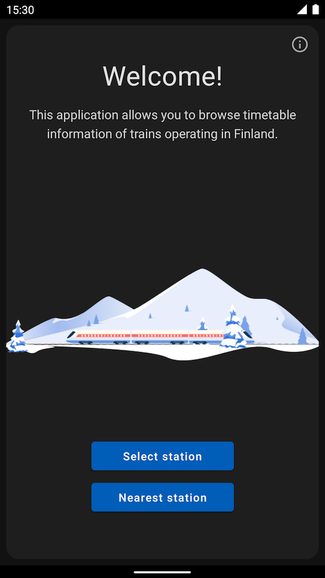

# Station

An android app for browsing timetable information of passenger trains operating
in Finland.

## Screenshots

|||
|---|---|
|  |  |
|  |  |
|  | |

## Technologies

- Kotlin
- Coroutines
- Jetpack Compose
- Hilt (for dependency injection)
- Store (for orchestrating data storing and fetching)
- Retrofit (for data fetching)
- Room (for storing data locally)
- DataStore (for application preferences)
- FusedLocationProvider (for location)
- Lottie (for animation)
- Truth (for fluent assertions)
- Mockito

## Data source

Source of traffic information: Traffic Management Finland / digitraffic.fi,
license CC 4.0 BY

## License
```
Copyright 2020 Juhani Jylhä

Licensed under the Apache License, Version 2.0 (the "License");
you may not use this file except in compliance with the License.
You may obtain a copy of the License at

    https://www.apache.org/licenses/LICENSE-2.0

Unless required by applicable law or agreed to in writing, software
distributed under the License is distributed on an "AS IS" BASIS,
WITHOUT WARRANTIES OR CONDITIONS OF ANY KIND, either express or implied.
See the License for the specific language governing permissions and
limitations under the License.
```
