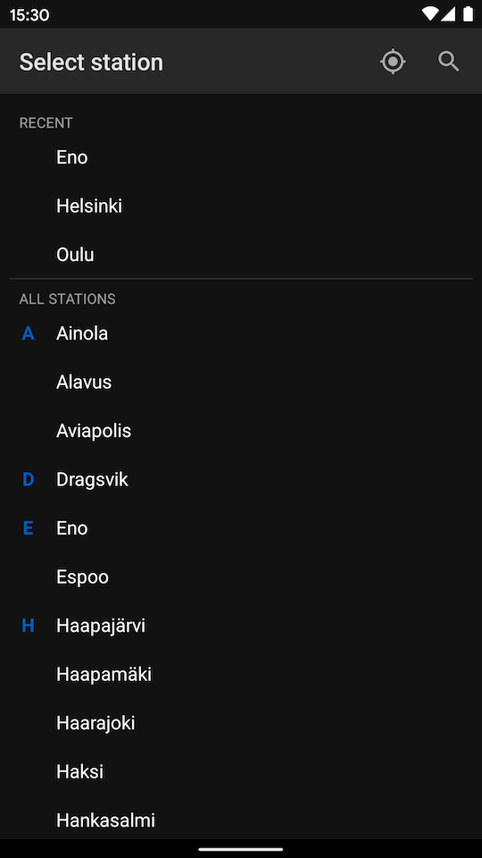

# Station

An android app for browsing timetable information of passenger trains operating
in Finland.

The application is a native Android application implemented with Kotlin. The
application architecture is based on reactive programming model and the reactive
streams are implemented with Kotlin Coroutines. 

The application UI is implemented completely with Jetpack Compose, the Android's
modern declarative UI toolkit, which is still in its alpha release. Using
Jetpack Compose requires the latest canary release of Android Studio.

## Features

The application contains five screens:

1. [**Home screen**][1] displays brief welcome message and allows the user to
proceed to select a station from a list of train stations or to move directly
to the timetable of the nearest station.
2. [**About screen**][2] displays some information about the application.
3. [**Stations screen**][3] contains a list train stations or stops in Finland
that have passenger traffic. The screen displays also a list of recently
selected stations and allows to search for a station by name.
4. [**Timetable screen**][4] shows the timetable information for the selected
station. The timetable contains a list of trains arriving and departing from the
station, along with times of arrival and departure, track number, and possible
delay causes. The list can be filtered to contain only arriving or departing
trains, or commuter or long-distance trains.
5. [**Train details screen**][5] displays more detailed information of a
selected train, which includes the train route, list of train's commercial stops
with arrival and departure times.

[1]: app/src/main/java/com/example/station/ui/home/HomeScreen.kt
[2]: app/src/main/java/com/example/station/ui/about/AboutScreen.kt
[3]: app/src/main/java/com/example/station/ui/stations/StationsScreen.kt
[4]: app/src/main/java/com/example/station/ui/timetable/TimetableScreen.kt
[5]: app/src/main/java/com/example/station/ui/train/TrainDetailsScreen.kt

## Screenshots

| Home screen | Stations screen |
|:---:|:---:|
|  |  |
| **Timetable screen** | **Timetable screen (with filters)** |
|  |  |
| **Train details screen** ||
|  | |

## Technologies

- Kotlin
- Coroutines
- Jetpack Compose
- Hilt (for dependency injection)
- Store (for orchestrating data storing and fetching)
- Retrofit (for data fetching)
- Room (for storing data locally)
- DataStore (for application preferences)
- FusedLocationProvider (for location)
- Lottie (for animation)
- Truth (for fluent assertions)
- Mockito

## Data source

Source of traffic information: Traffic Management Finland / digitraffic.fi,
license CC 4.0 BY

## License
```
Copyright 2020 Juhani Jylhä

Licensed under the Apache License, Version 2.0 (the "License");
you may not use this file except in compliance with the License.
You may obtain a copy of the License at

    https://www.apache.org/licenses/LICENSE-2.0

Unless required by applicable law or agreed to in writing, software
distributed under the License is distributed on an "AS IS" BASIS,
WITHOUT WARRANTIES OR CONDITIONS OF ANY KIND, either express or implied.
See the License for the specific language governing permissions and
limitations under the License.
```
